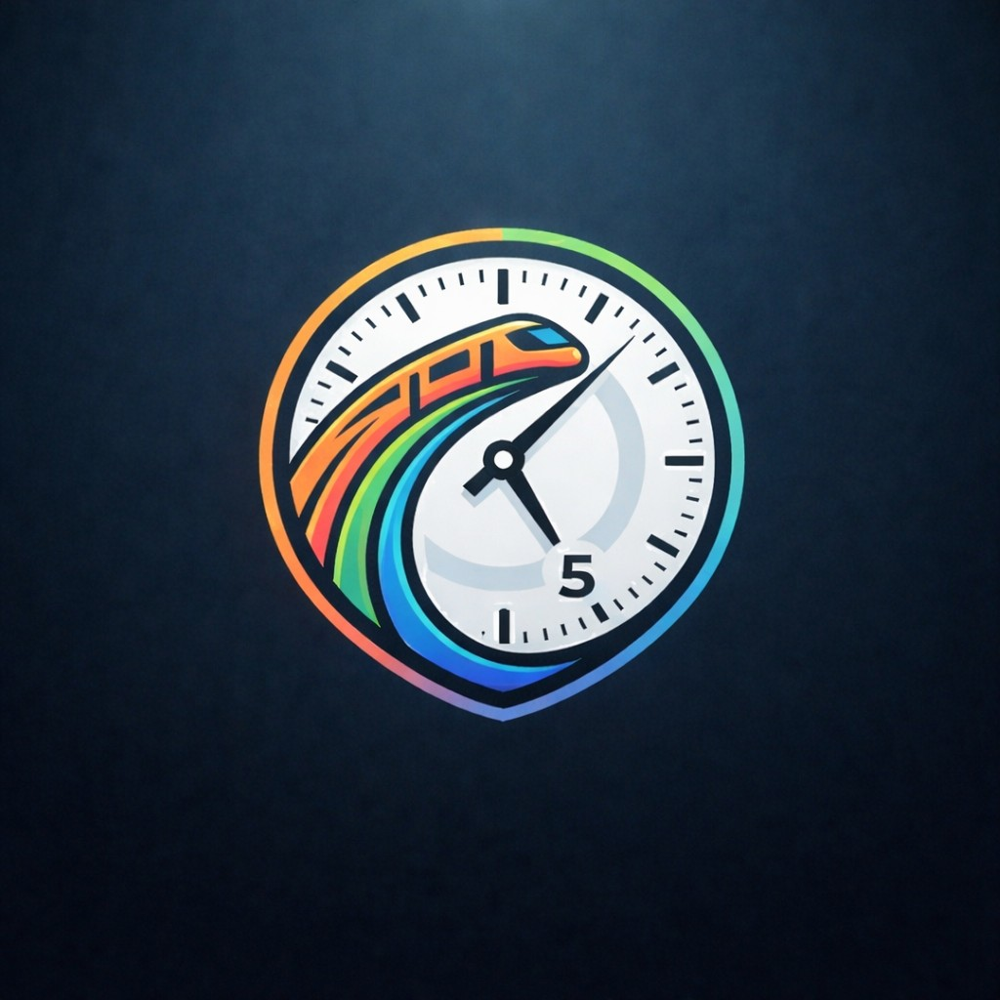

# tMinus



Open-source Android widgets and tools for MBTA riders. Application ID: **`com.saarlabs.tminus`**. The first feature is a **home screen trip widget** (Jetpack Glance) based on the contribution in [mbta/mobile_app#1593](https://github.com/mbta/mobile_app/pull/1593), adapted to call the public **MBTA V3 API** directly.

The in-app UI uses bottom navigation: **Home**, **Roadmap** (current and possible future features), and **Settings** (API keys and documentation links).

**Commutes** (from Home): save **multiple** named routes (from/to stops), **days of week**, a **target time**, and a **window** (minutes before/after) used to query schedules. Set **notify X minutes before departure** for a “time to leave” notification, and optionally a second ping around **scheduled arrival**. Checks run on a background schedule (about every 15 minutes) using **schedule data** from the MBTA V3 API—not live predictions. Grant **notification permission** on Android 13+ when prompted.

**Last / first train** alerts: pick **route id**, **direction id** (0 or 1), **stop**, **last vs first** mode, optional **time windows** (as minutes-from-midnight), and **notify N minutes before** that scheduled departure. Uses the latest/earliest departure in the window from the schedule API.

**Elevator & station alerts**: watch a **route** + **station**; the app pulls **active alerts** for that route and notifies when an alert’s text plausibly matches your station (elevator/escalator/stop-closure effects). This is **heuristic**—not a guarantee every outage is detected.

## API keys (optional but recommended)

The app works without keys for light use. For higher rate limits, request a free key from the V3 portal and paste it in **Settings** inside the app.

- **V3 API (schedules, stops, routes):** [MBTA Developers — V3 API](https://www.mbta.com/developers/v3-api) and [V3 API Portal](https://api-v3.mbta.com/) — paste your key in **Settings** in the app.

## Build locally

1. Install [Android Studio](https://developer.android.com/studio) or the Android SDK and set `ANDROID_HOME`.
2. Clone this repository.
3. From the project root:

```bash
./gradlew assembleDebug
```

Install `app/build/outputs/apk/debug/app-debug.apk` on your device.

## Contributing

See [CONTRIBUTING.md](CONTRIBUTING.md) for how to report issues, submit pull requests, and set up a dev environment.

## CI and installable APK

GitHub Actions builds a debug APK on each push and uploads it as a workflow artifact (`tminus-debug-apk`).

**Rolling build from `main`:** each merge to `main` updates the prerelease [**Latest main (debug)**](https://github.com/saarhaber/Tminus/releases/tag/latest-main) on the Releases page with a fresh `app-debug.apk` (tag `latest-main`). The release title and description include a **Built (UTC)** time so you can tell when the APK last changed—GitHub’s own “published” date for that rolling entry can stay stale.

**Versioned release:** create and push a tag such as `v0.1.0`; the [tag release workflow](.github/workflows/release-apk.yml) attaches the debug APK to that numbered release.

### Create the GitHub repository (owner: saarhaber)

This environment cannot create repositories under your personal account. On your machine, with the [GitHub CLI](https://cli.github.com/) logged in as `saarhaber`:

```bash
cd /path/to/Tminus
gh repo create saarhaber/Tminus --public --source=. --remote=origin --push
```

Or create an empty repo named `Tminus` on GitHub, then:

```bash
git remote add origin https://github.com/saarhaber/Tminus.git
git push -u origin main
```

## License

Apache-2.0 (see [LICENSE](LICENSE)).
